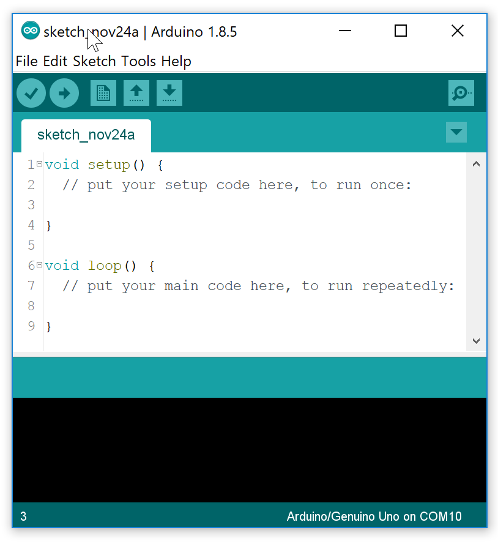
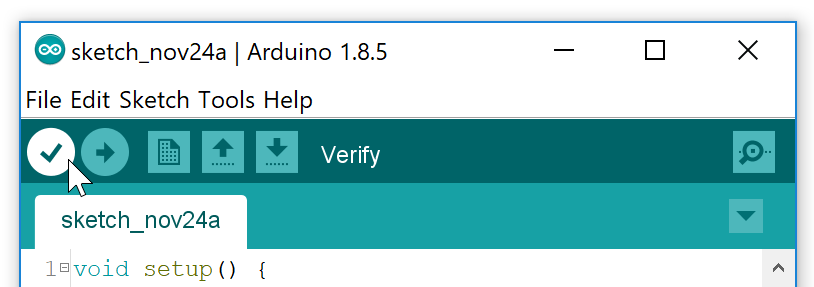
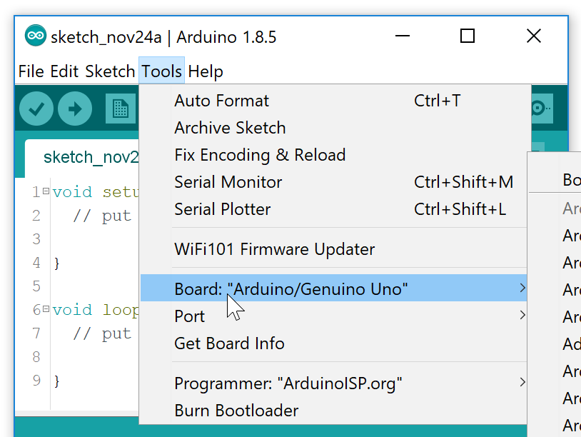
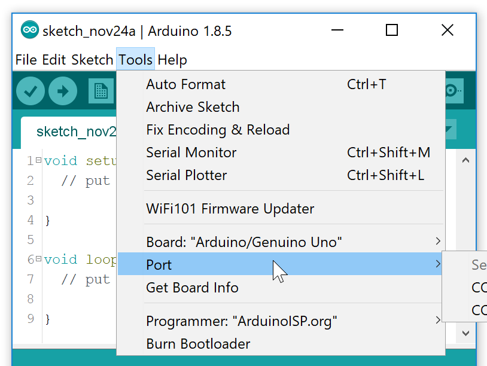
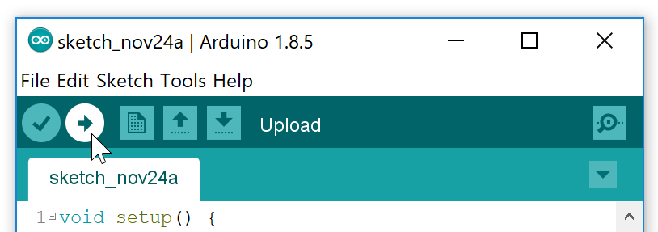

# Blink

## Getting started

Download and install the Arduino environment ([download](https://www.arduino.cc/en/Main/Software)). Make sure to get the stand-alone version, not the web plugin.

Start the environment you should see an empty program (called a sketch in Arduino world):

You will notice the sketch already contains two function: `setup()` and `loop()`. These two functions are the minimal requirement for any Arduino sketch, like `main()` is for C-programs. The `setup()` function will run only once, directly after starting the Arduino. Once `setup()` finishes, `loop()` will be executed and repeated forever (well, until you turn the Arduino off).

## Exercise

Let’s write some code to make a LED blink. The Arduino language is essentially C++. If you know C, you will notice that a lot of it feels very familiar.

In the `setup()` enter the following code:

    pinMode(13, OUTPUT);

As you might have guessed, this will tell pin 13 on the Arduino to operate as output pin. This means that we can use it to control, for example, a LED.

Now, in the `loop()` enter the following code:

    digitalWrite(13, HIGH);
    delay(1000);           
    digitalWrite(13, LOW);
    delay(1000);     

The line `digitalWrite(13, HIGH)` tells pin 13 to provide a high (5V) voltage, essentially turning the LED connected to pin 13 on. The line `digitalWrite(13, LOW)` sets the voltage to 0, turning the LED off. `delay(1000)` tells the program to do nothing for 1000 milliseconds (1 sec).

Save your file under the name “blink”.

### Compile & Upload

To check if your program is (syntactically) correct, press the compile button:

Let’s upload this sketch. Make sure the Arduino is connected to a USB-port of your computer. Before you upload you have to check if the right *board* and *port* are selected:

Go to Tools>Board and select your Arduino model (e.g. Arduino/Genuino Uno):

Now, go to Tools>Serial Port and select the right port:

Once you have done this, you’re ready to upload your sketch. Press the upload button:

During the programming, you’ll see a LED on your Arduino blinking erratically. If all is well, this will stop after a couple of seconds and you’ll see the LED turn on and off regularly with a period of two seconds.

Congrats! You’ve written your first Arduino sketch.
