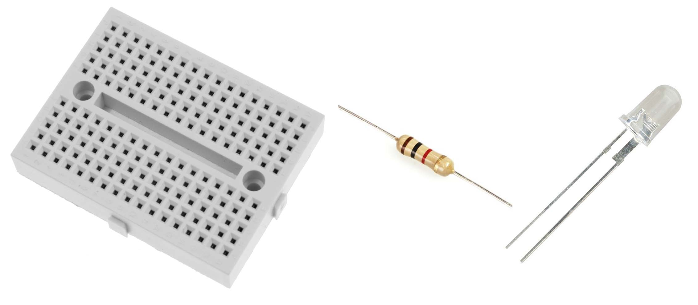
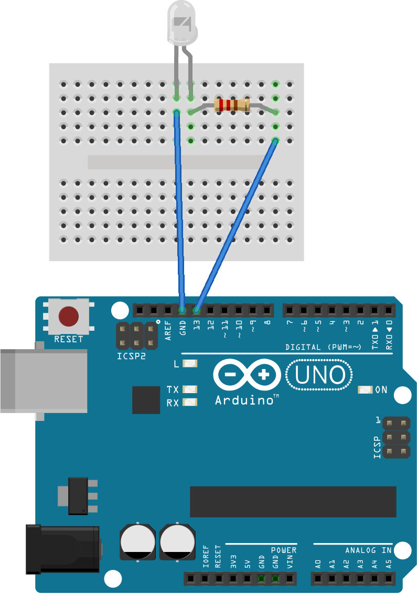

# Connect your own LED

In the previous exercise you learned to program the built-in LED of the Arduino. Now let’s try to do the same with an external LED.

You’ll need a LED, a resistor (1kΩ will do), a breadboard and a couple of wires:

## Exercise

> **Before you get started unplug/turn off the Arduino!!!** You don't want to build a circuit when the Arduino is powered. You could short circuit it and break something.

Build the following circuit:

If you're not sure how to use a breadboard have a look here: [Breadboard wiring](arduino/Breadboard).

> Note that a LED has a positive and negative pole, if you connect a LED the wrong way around, it doesn’t do anything. [More information](arduino/BG-LED)

If you turn the Arduino on and you connected the LED correctly, you should see the LED blinking.

Congrats! You built your first circuit!
