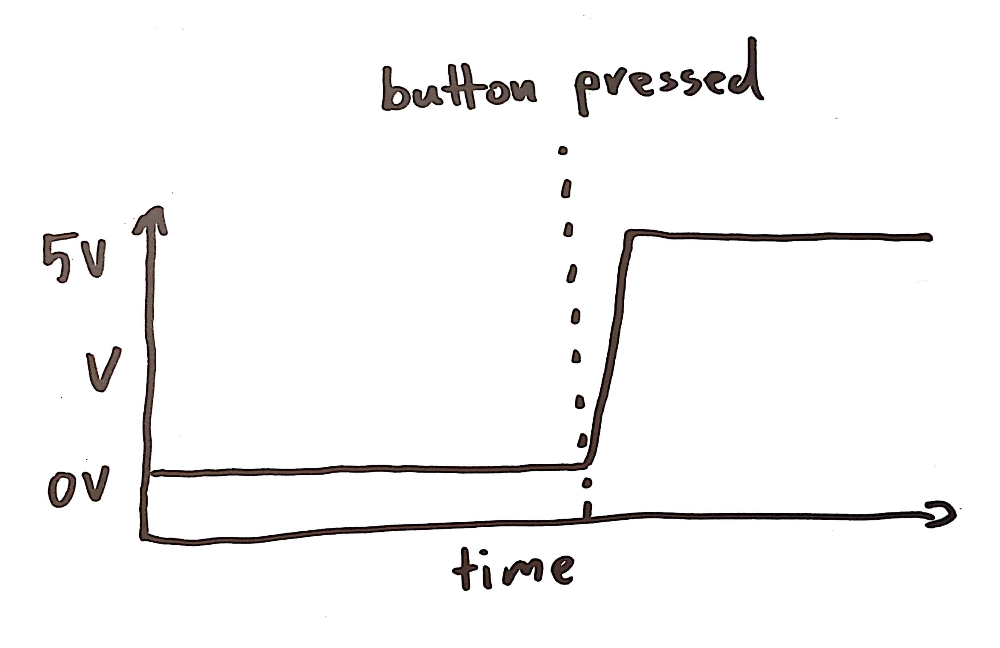
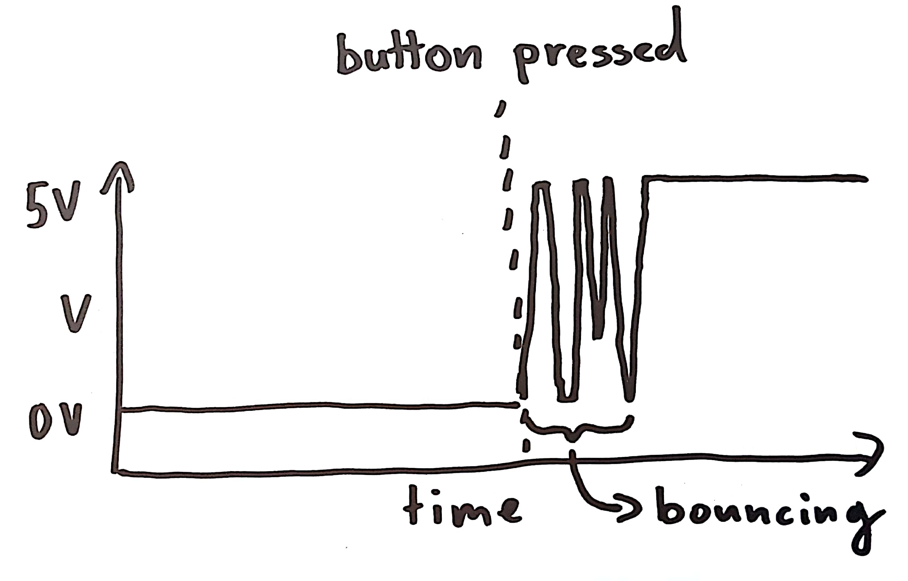

# Debounce

## Exercise

Use a button to toggle the LED on and off. So when you press the button the LED turns on. The LED stays on until you press the button again.

> Does it reliably turn on or off? What happens when you keep the button pressed?

It is likely you will run into a problem that makes programming a bit more challenging (and more interesting) than the protected world of your computer: noise!

The push button is a mechanical device. When you push it, the contact plates in the button touch. The problem is, they don’t do so cleanly. You would hope the input does something like this:

However, in reality it goes more like this:

The mechanical contacts in the button bounce, making the signal jump up and down for a couple of milliseconds after pressing or releasing the button. This is called _bouncing_. You will have to take this into account when programming the toggle button.
