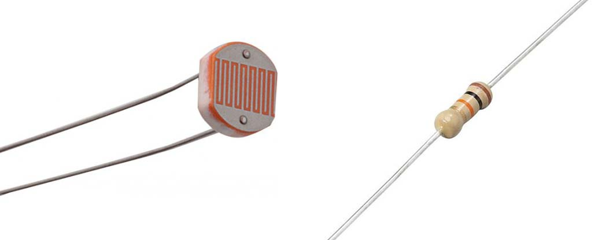
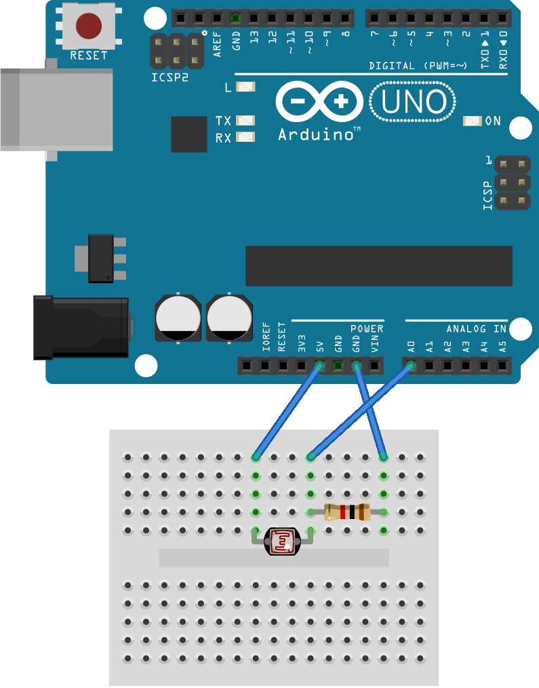

# Light sensor

So far you have seen `digitalWrite` (to control a LED), `digitalRead` (to read a button state), `analogWrite` (to dim a LED). There is one function ostentatiously missing: `analogRead`. We're going to use that function to read out a _light dependent resistor_ (LDR).

## Getting started

### Circuit

First we need to build the circuit. For this we need a resistor and an LDR:

Here below there is an example of how to connect them.

### Code

The code below shows how to use `analogRead` to read the LDR.

    void setup()
    {
      Serial.begin(9600);
      pinMode(A0, INPUT);
    }

    void loop()
    {
      int ldrValue = analogRead(A0);
      Serial.println(ldrValue);
      delay(20);
    }

Copy this sketch and save as `LDR`. Compile, upload and test.

> Contrary to `analogWrite`, `analogRead` is actually analog. No PWM trickery here. The higher the voltage on pin `A0`, the higher the value `analogRead` returns.

> The value that `analogWrite` returns is a *10 bit* value, not 8 bits. This means that 5V corresponds to the value 1023 and 0V corresponds to 0. What would be the value of `analogRead(A0)` when the voltage on `A0` is 1V?

## Exercise

Make an automatic light switch: Use an LDR to control a LED. When it is dark enough, make the LED turn on and when it is lighter, the LED turns off.
