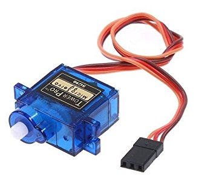
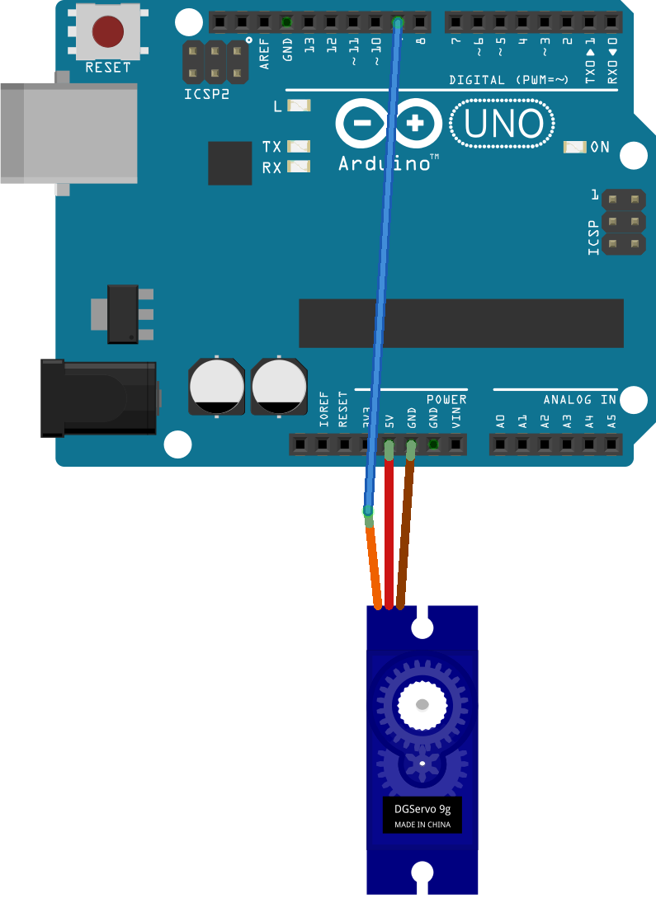

# Servo

One of the most fun things to do with the Arduino is to make robots. To make robots, we need to control motors. A type of motor commonly used in robots are servo motors.

Servo motors do not rotate continuously (like normal DC motors do). You can set them to a specific angle, and they will maintain that angle until instructed otherwise.

In this exercise you will discover how easy it is to connect a servo to the Arduino and program it.

## Getting started

### Circuit

You will need a 9g micro servo:

This is how you connect it to the Arduino:

> Pay attention to the color of the wires. Red goes to the power supply (5V), brown to ground (GND), and yellow is the signal wire (connect to pin 9).

### Code

The following code lets the angle of the servo alternate between 0 and 180 degrees.

    #include <Servo.h>

    Servo myservo;

    void setup() {
      myservo.attach(9);
    }

    void loop() {
      myservo.write(0);             
      delay(500);
      myservo.write(180);             
      delay(500);      
    }

As you can see, we include the library `Servo.h`. This library comes with the Arduino IDE. The protocol that we use to communicate with the servo is very timing sensitive. Fortunately the servo library takes care of that, so we don't have to worry about it now.

Controlling the servo consists of three parts:

1. We need to create a `Servo` variable called `myservo`.
2. The line `myservo.attach(9)` activates the servo on pin 9.
3. The line `myservo.write(0)` sets the angle of the servo to 0 degrees. The line `myservo.write(180)` sets it to 180 degrees.

Copy the code above, and run it on the Arduino. Test to see if the servo is actually moving.

## Exercise

Use either the push button or the LDR to control the servo. Make the servo turn at the push of a button, or make it react to intensity of the light.
