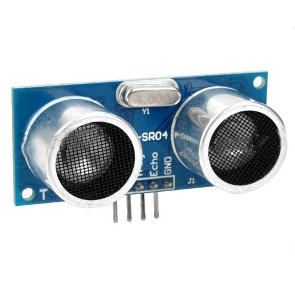
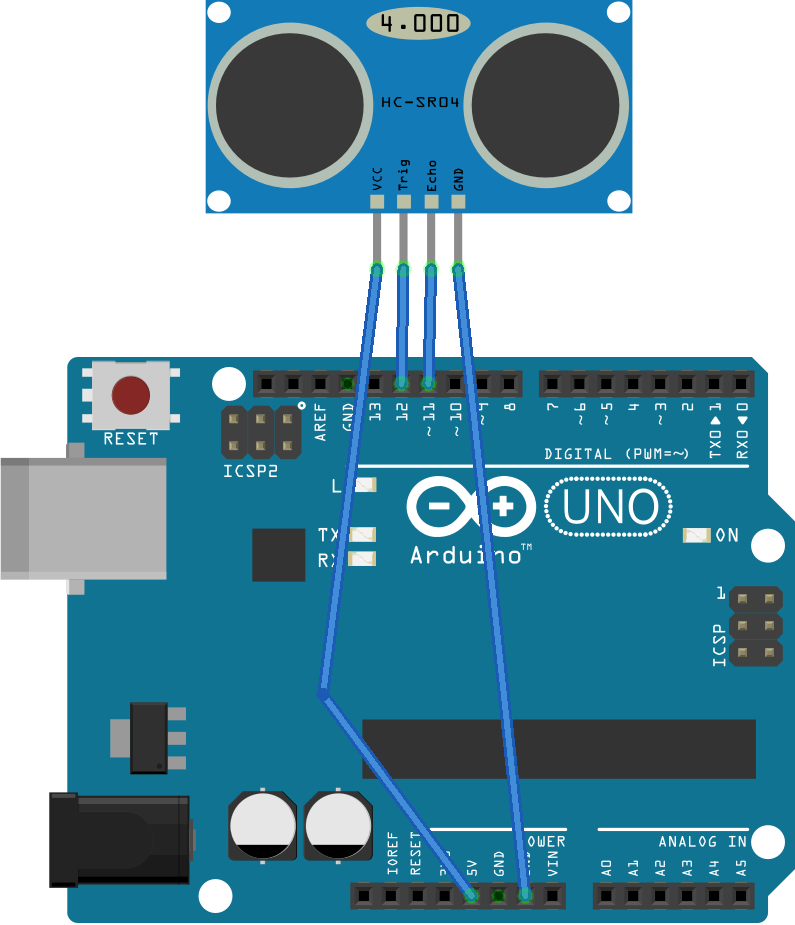

# Sonar

Use a Sonar to measure distances. A sonar sends a sound pulse and measures the time it takes for the echo to return. This allows us to estimate the distance of obstacles. [More information](arduino/BG-Sonar)

## Getting started

### Circuit

You will need a HC-SR04 sonar sensor:

This is how you connect it to the Arduino:

> Pay attention to labels of the pins. VCC goes to the power supply (5V), GND to GND, 'trig' to pin 12, and 'echo' to pin 11.

### Code

Before you can start coding, you need to download the NewPing library ([dowload](http://playground.arduino.cc/Code/NewPing)---follow the instructions on the download page).

Once you downloaded and installed the NewPing library, restart your Arduino IDE and enter the following code:

    #include <NewPing.h>

    #define TRIGGER_PIN  12
    #define ECHO_PIN     11
    #define MAX_DISTANCE 200

    NewPing sonar(TRIGGER_PIN, ECHO_PIN, MAX_DISTANCE);

    void setup() {
      Serial.begin(9600);
    }

    void loop() {
      delay(2000);
      Serial.print("Ping: ");
      Serial.println(sonar.ping());
    }

The NewPing library takes care of the timing protocol. The function `sonar.ping()` returns the time between the trigger sound pulse and its echo in microseconds.

## Exercise 1

The function `sonar.ping()` essentially gives you the 'distance' to an object in microseconds. We (normal people) prefer to think in centimeters (or inches if from _that_ corner of the world).

Create a program that computes the distance to an object in centimeters rather than microseconds. Tip, have a look here: [https://en.wikipedia.org/wiki/Speed_of_sound](https://en.wikipedia.org/wiki/Speed_of_sound)

## Exercsie 2

Use to sonar to blink a LED when an object is getting very close (let's say closer than 10cm).
