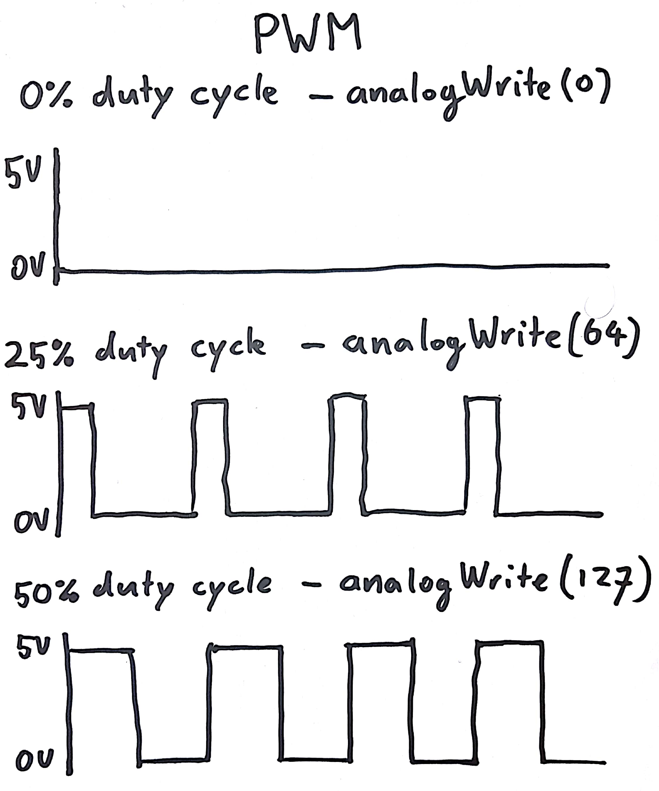

# PWM

When can use `analogWrite` to dim a LED. It might be tempting to assume that `analogWrite` provides an analog signal (not in the last place, because it is called '_analog_ Write'). But this is not the case.

When we call `analogWrite(13, 255)` it does the same as `digitalWrite(13, HIGH)`: it puts 5V on pin 13. Similarly, `analogWrite(13, 0)` puts 0V on pin 13. If `analogWrite` where truly analog, `analogWrite(13, 127)` would put 2.5V on the pin. This is not the case. It turns out that converting digital signals to analog signals is relatively complicated and often not needed. What `analogWrite` actually does is switching the power on and off very rapidly, making the LED blink very rapidly. Since it goes too fast for our eyes, our brain does the rest of the work: It does not perceive the blinking, it just sees the LED as constantly on, but at a lower intensity.

This mechanism is called _pulse width modulation_ (PWM). The duration of the 'on' time with respect to the 'off' time is called the duty cycle.

