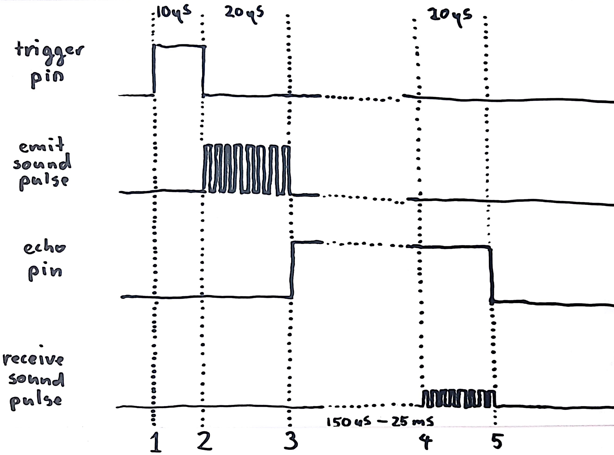

# Sonar

The general idea behind sonar is: 1 you send a sound pulse, 2 you measure how much time its echo takes to return. Given that we know the speed of sound, we can calculate the distance of objects.

One of the most common Arduino sonar sensors is the HC-SR04.

## HC-SR04 Sensor

The HC-SR04 has a fairly simple protocol: You instruct the sensor to send a sound pulse, using the 'trig' pin. The sensor returns a pulse over the 'echo' pin. The duration of that pulse corresponds to the time the echo took to return.

To be a bit more precise, consider the following figure:

What happens:

0. At the start, both the 'trig' pin and 'echo' pin are LOW.
1. The Arduino sets the 'trig' pin to HIGH.
2. Exactly 10 microseconds later the Arduino sets the 'trig' pin to LOW. This instructs the sensor to send the sound pulse. The Arduino should start monitoring the 'echo' pin.
3. The sonar sends a 20 microseconds sound pattern (8 pulses at 40kHz).
4. The sonar listens for the pattern to return.
5. Once the echo pattern is finished, the sonar sets the 'echo' pin to LOW.

If you instructed the Arduino to listen to the 'echo' pin and register the duration of the pulse, you know now how long the sound has travelled.
